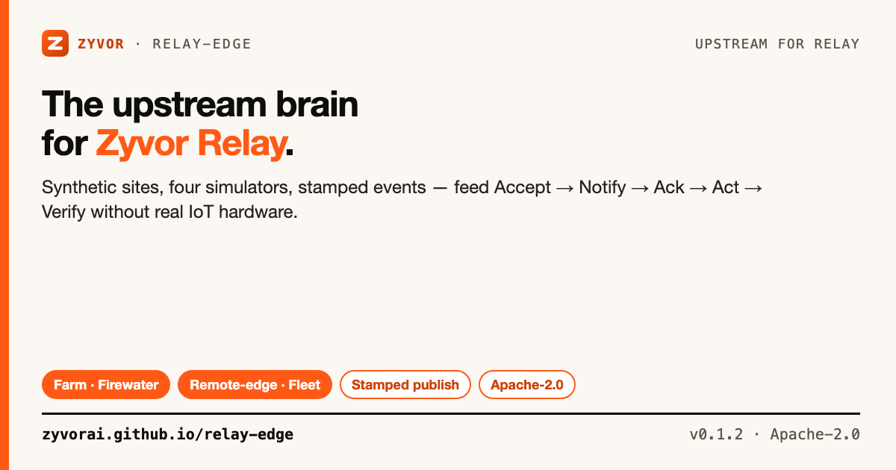
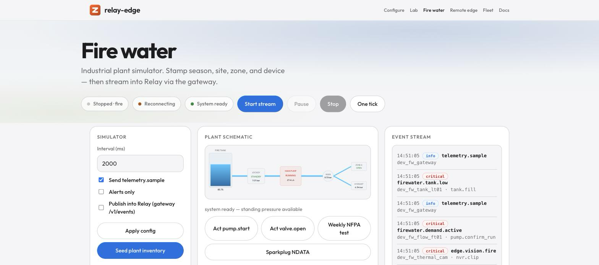
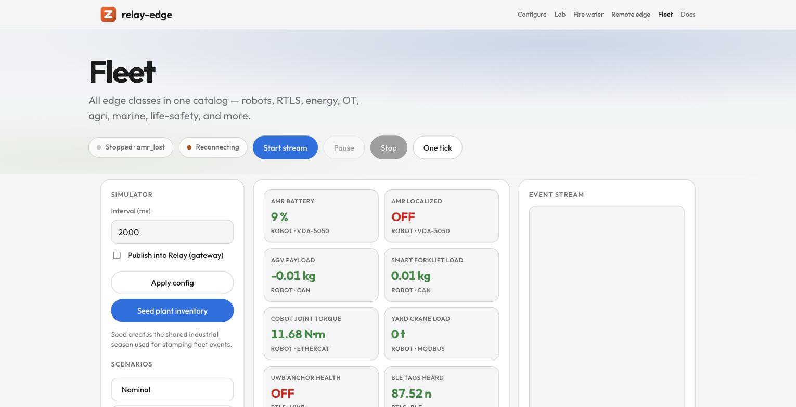
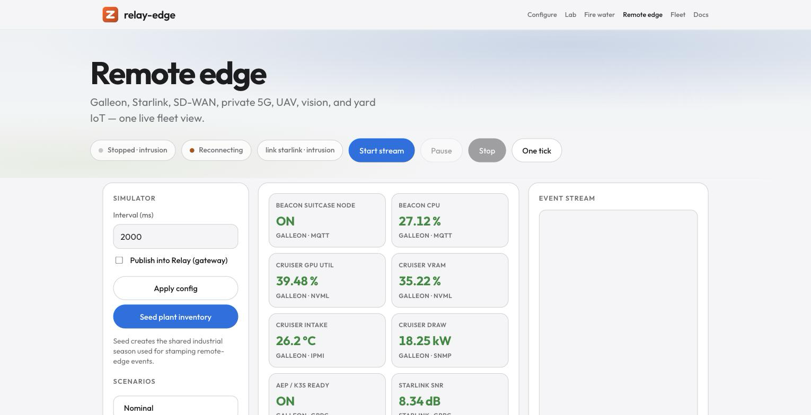

# relay-edge

[](https://github.com/zyvorai/relay-edge/actions/workflows/ci.yml)
[](LICENSE)
[](https://go.dev/)
[](CHANGELOG.md)



**The upstream brain for [Zyvor Relay](https://github.com/zyvorai/relay).**

📖 **[Read the full docs](https://zyvorai.github.io/relay-edge/)** — getting started, simulators, integration, and production checklist.

Site topology, four IoT simulators, and stamped events — with browser control rooms you can drive in minutes. Relay runs the durable loop: **Accept → Notify → Ack → Act → Verify**. relay-edge runs everything **before** Accept: seasons, sites, zones, devices, contacts, telemetry probes, and simulators that publish stamped events into Relay — via [relay-pubsub](https://github.com/zyvorai/relay-pubsub) or direct.

> At sites that also run **[Zynera](https://github.com/zyvorai/forge)**, Relay can optionally gate critical acts behind Decision Records. relay-edge only publishes events — it never calls Zynera. → [docs/ZYNERA.md](docs/ZYNERA.md)

## Contents

- [Where this fits](#where-this-fits)
- [Is this for you?](#is-this-for-you)
- [What you get](#what-you-get)
- [Quick start](#quick-start)
- [Control rooms](#control-rooms)
- [Publish into Relay](#publish-into-relay)
- [Event families](#event-families)
- [Simulate full stack](#simulate-full-stack)
- [Documentation](#documentation)
- [Deploy](#deploy)
- [License](#license)

## Where this fits

| Layer | Repo | Role at the edge |
|-------|------|------------------|
| **relay-edge** | this repo | Stamp domain context · simulators · `/ui` control rooms |
| **relay-pubsub** | [relay-pubsub](https://github.com/zyvorai/relay-pubsub) | Google Pub/Sub wire → Relay (optional but preferred) |
| **Relay** | [relay](https://github.com/zyvorai/relay) | Notify · Ack · Act · Verify · policies |
| **Zynera** | [Zynera](https://github.com/zyvorai/forge) | GPU/AI/K8s at edge sites · optional Decision Records |

**Two “edges”:** Zynera edge = where AI workloads run. relay-edge = where operational events get stamped and published. Same physical site, different jobs.

```text
 ┌──────────────────────────────────────────────────────────────────────┐
 │  Zynera edge site (optional)                                          │
 │  Zynera :30631 — GPUs · federation · Zeus · Decision Records          │
 │  relay-edge :18086 — farm · firewater · remote-edge · fleet · /ui      │
 └───────────────────────────────┬──────────────────────────────────────┘
                                 │ stamp + publish
              ┌──────────────────┴──────────────────┐
              ▼                                     ▼
   GATEWAY_BASE_URL set                  GATEWAY_BASE_URL empty
   relay-pubsub :8081                    POST /v1/events (direct)
              │                                     │
              └──────────────────┬──────────────────┘
                                 ▼
                          Zyvor Relay (:8443 or :18080)
                          Accept → Notify → Ack → Act → Verify
```

## Is this for you?

relay-edge is a small, open-source (Apache-2.0) **synthetic site/event generator** — realistic topology and traffic for Zyvor Relay, without real IoT hardware. It is not a device manager and does not manage real fleets.

> **Maturity (honest):** v0.1.2 engineering preview — CI smokes, tagged releases, lab auth+TLS when `EDGE_REQUIRE_AUTH=1` + `EDGE_API_TOKEN` are set. Suitable as a controlled-site event feeder after [docs/PRODUCTION.md](docs/PRODUCTION.md); defaults remain lab-open until you enable auth + real TLS. See [docs/QUALIFICATION.md](docs/QUALIFICATION.md).

New here? [`docs/FAQ.md`](docs/FAQ.md) · troubleshooting in [`docs/INTEGRATION.md`](docs/INTEGRATION.md#troubleshooting)

## What you get

| Capability | Details |
|------------|---------|
| **Farm domain API** | Sites, zones, devices, contacts, seasons — JSON on disk, REST CRUD |
| **Stamping** | Every event gets season/site/zone/recipients/verification probe before Relay |
| **Firewater simulator** | 47-point NFPA-style plant + edge AI/comms — `/ui` |
| **Remote-edge simulator** | Distributed site NOC: satellite, compute rack, UAV, vision |
| **Fleet simulator** | 77 devices, 18 edge classes |
| **Two publish paths** | relay-pubsub (production) or direct Relay — [docs/RELAY.md](docs/RELAY.md) |
| **Deploy anywhere** | `go run`, systemd, Kubernetes (pairs with relay-pubsub) |

All simulators: **Seed → Publish into Relay → Scenarios → Live SSE stream**.

## Quick start

```bash
git clone https://github.com/zyvorai/relay-edge.git
cd relay-edge
make build
go run ./cmd/relay-edge   # HTTPS by default (self-signed under ./data/tls)
# open https://127.0.0.1:18086/ui/  (accept certificate warning)
# EDGE_TLS=0 for plain HTTP
```

```bash
./scripts/smoke.sh              # farm lifecycle (no Relay required)
./scripts/smoke-firewater.sh
./scripts/smoke-remote-edge.sh
./scripts/smoke-fleet.sh
make smoke-all
```

**First time?** → [docs/GETTING_STARTED.md](docs/GETTING_STARTED.md)

## Control rooms

| Browser | Control room |
|---------|--------------|
| [https://127.0.0.1:18086/ui](https://127.0.0.1:18086/ui) | Home · configure · lab · logs |
| [https://127.0.0.1:18086/ui/firewater.html](https://127.0.0.1:18086/ui/firewater.html) | Fire-water plant |
| [https://127.0.0.1:18086/ui/remote-edge.html](https://127.0.0.1:18086/ui/remote-edge.html) | Remote edge NOC |
| [https://127.0.0.1:18086/ui/fleet.html](https://127.0.0.1:18086/ui/fleet.html) | All edge classes |
| [https://127.0.0.1:18086/ui/docs.html](https://127.0.0.1:18086/ui/docs.html) | Docs & stack test results |

<table>
<tr>
<td width="50%">

**[`/ui`](https://127.0.0.1:18086/ui) — home & lab**


</td>
<td width="50%">

**[`/ui/firewater.html`](https://127.0.0.1:18086/ui/firewater.html) — fire-water plant**


</td>
</tr>
<tr>
<td width="50%">

**[`/ui/fleet.html`](https://127.0.0.1:18086/ui/fleet.html) — 77 devices, 18 edge classes**


</td>
<td width="50%">

**[`/ui/remote-edge.html`](https://127.0.0.1:18086/ui/remote-edge.html) — distributed site NOC**


</td>
</tr>
</table>

## Publish into Relay

Peers may be remote — set URLs to the hosts where those services listen.

### Via relay-pubsub (preferred)

```bash
export GATEWAY_BASE_URL=https://<pubsub-host>:8081
export RELAY_AUTH_TOKEN=<jwt>
export RELAY_TLS_INSECURE=1
go run ./cmd/relay-edge
```

### Direct to Relay

```bash
export GATEWAY_BASE_URL=
export RELAY_BASE_URL=https://<relay-host>:8443
export RELAY_AUTH_TOKEN=<jwt>
export RELAY_TLS_INSECURE=1
go run ./cmd/relay-edge
```

In any UI: **Seed plant inventory** → **Publish into Relay** → scenario. → [docs/RELAY.md](docs/RELAY.md)

## Event families

| Family | Count | Example types |
|--------|-------|---------------|
| **Farm** | 10 | `irrigation.required`, `crop.advisory`, `frost.alert` |
| **Firewater / edge** | 20+ | `firewater.tank.low`, `edge.comms.down`, `edge.vision.fire` |
| **Remote edge** | 6 | `remote-edge.link.offline`, `remote-edge.galleon.thermal` |
| **Fleet** | 6 | `fleet.power.island`, `fleet.robot.lost` |

```bash
# Full matrix via pubsub
BASE=https://<relay>:8443 GATEWAY=https://<gateway>:8081 EDGE=https://<edge>:18086 \
  ./scripts/e2e-events-matrix.sh

# Direct to Relay
BASE=https://<relay>:8443 EDGE=https://<edge>:18086 RELAY_AUTH_TOKEN=<jwt> \
  ./scripts/e2e-direct-relay.sh
```

## Simulate full stack

```bash
cp config/lab-stack.env.example config/lab-stack.env
# BASE / GATEWAY / EDGE = reachable host URLs
set -a && source config/lab-stack.env && set +a
./scripts/e2e-stack.sh
```

→ [docs/INTEGRATION.md](docs/INTEGRATION.md). Lab verification: [docs/TEST_RESULTS.md](docs/TEST_RESULTS.md).

### Zynera + decision-making

relay-edge **publishes**. Relay runs the loop. Zynera holds optional human approval records. Configure on **Relay**:

```bash
RELAY_FORGE_BASE_URL=http://<zynera-host>:30631
RELAY_FORGE_API_KEY=<zynera-api-gateway-secret>
```

## Documentation

| Guide | What's inside |
|-------|---------------|
| [zyvorai.github.io/relay-edge](https://zyvorai.github.io/relay-edge/) | Product docs |
| [docs/FAQ.md](docs/FAQ.md) | Licensing, support, scope |
| [docs/GETTING_STARTED.md](docs/GETTING_STARTED.md) | Clone → run → smoke |
| [docs/SIMULATORS.md](docs/SIMULATORS.md) | Scenarios, event types, UI |
| [docs/RELAY.md](docs/RELAY.md) | Direct vs gateway |
| [docs/INTEGRATION.md](docs/INTEGRATION.md) | relay-edge + Relay + Zynera |
| [docs/PRODUCTION.md](docs/PRODUCTION.md) | Auth, TLS, checklist |
| [docs/CONFIGURATION.md](docs/CONFIGURATION.md) | All environment variables |

Social assets: [docs/social/](docs/social/).

## Deploy

| Target | Command |
|--------|---------|
| **Local** | `go run ./cmd/relay-edge` or `./bin/relay-edge` |
| **Linux host** | `./scripts/deploy-remote.sh <HOST> [USER]` |
| **Container** | `ghcr.io/zyvorai/relay-edge:latest` (or `:v0.1.2`) |
| **Kubernetes** | `./deploy/scripts/deploy-k8s-remote.sh <HOST> [USER]` |

k8s deploys **relay-edge + relay-pubsub** together. → [docs/DEPLOYMENT.md](docs/DEPLOYMENT.md)

Key env: `EDGE_HTTP_ADDR` (`:18086`), `EDGE_TLS`, `EDGE_API_TOKEN` / `EDGE_REQUIRE_AUTH`, `GATEWAY_BASE_URL`, `RELAY_BASE_URL`. Full table: [docs/CONFIGURATION.md](docs/CONFIGURATION.md).

## Part of the Zyvor stack

| Project | Role |
|---------|------|
| **[relay](https://github.com/zyvorai/relay)** | Accept → Notify → Ack → Act → Verify |
| **[relay-pubsub](https://github.com/zyvorai/relay-pubsub)** | Google Pub/Sub compatibility at the edge |
| **relay-edge** (here) | Domain, simulators, stamped publishes |
| **[Zynera](https://github.com/zyvorai/forge)** | AI/K8s at edge; Decision Records via Relay |

## License

### Open source (Apache-2.0)

Licensed under the [Apache License, Version 2.0](LICENSE). Personal, lab, and commercial production use at no charge, subject to Apache-2.0 (preserve notices / NOTICE where required).

### Enterprise

Production support, SLAs, and Zyvor Enterprise products are licensed separately.
Contact [sales@zyvor.dev](mailto:sales@zyvor.dev) or see [zyvor.dev](https://zyvor.dev).
