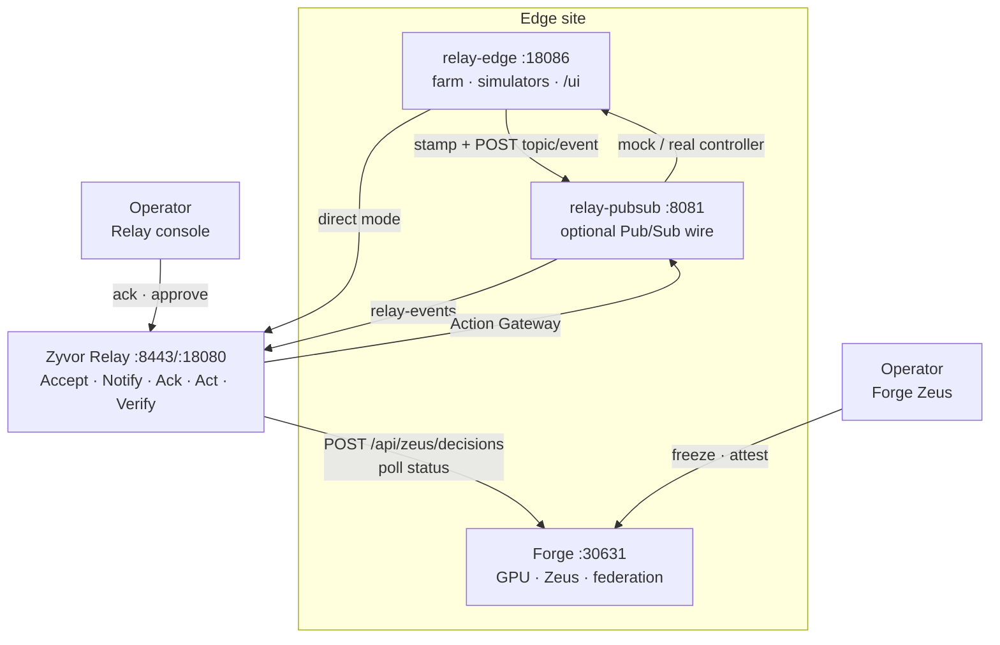
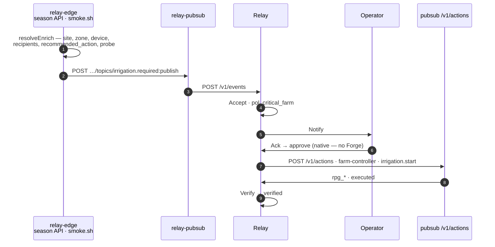
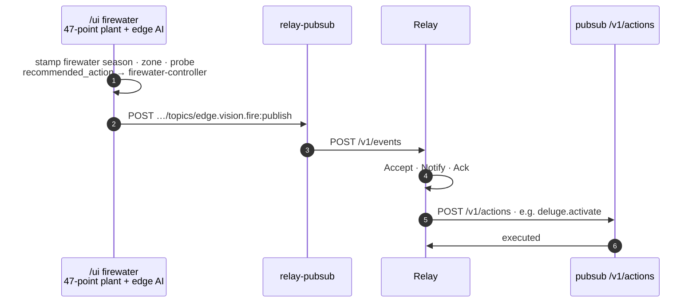
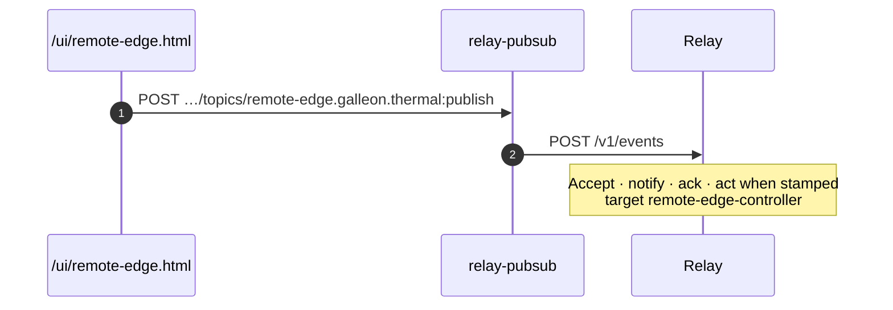
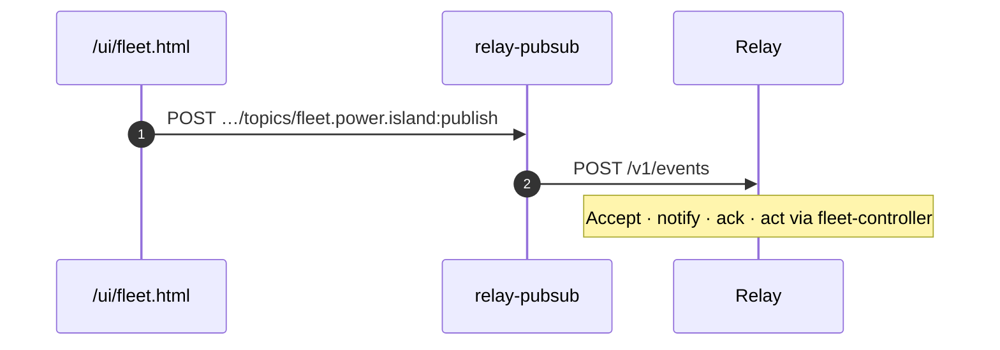
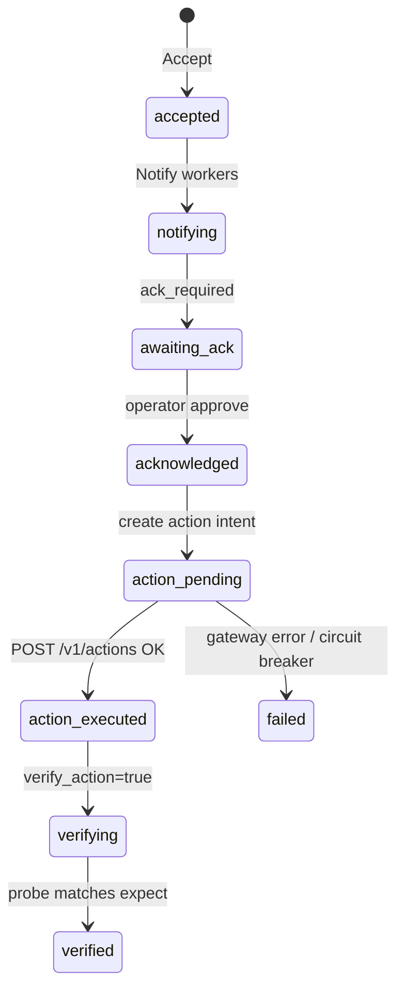
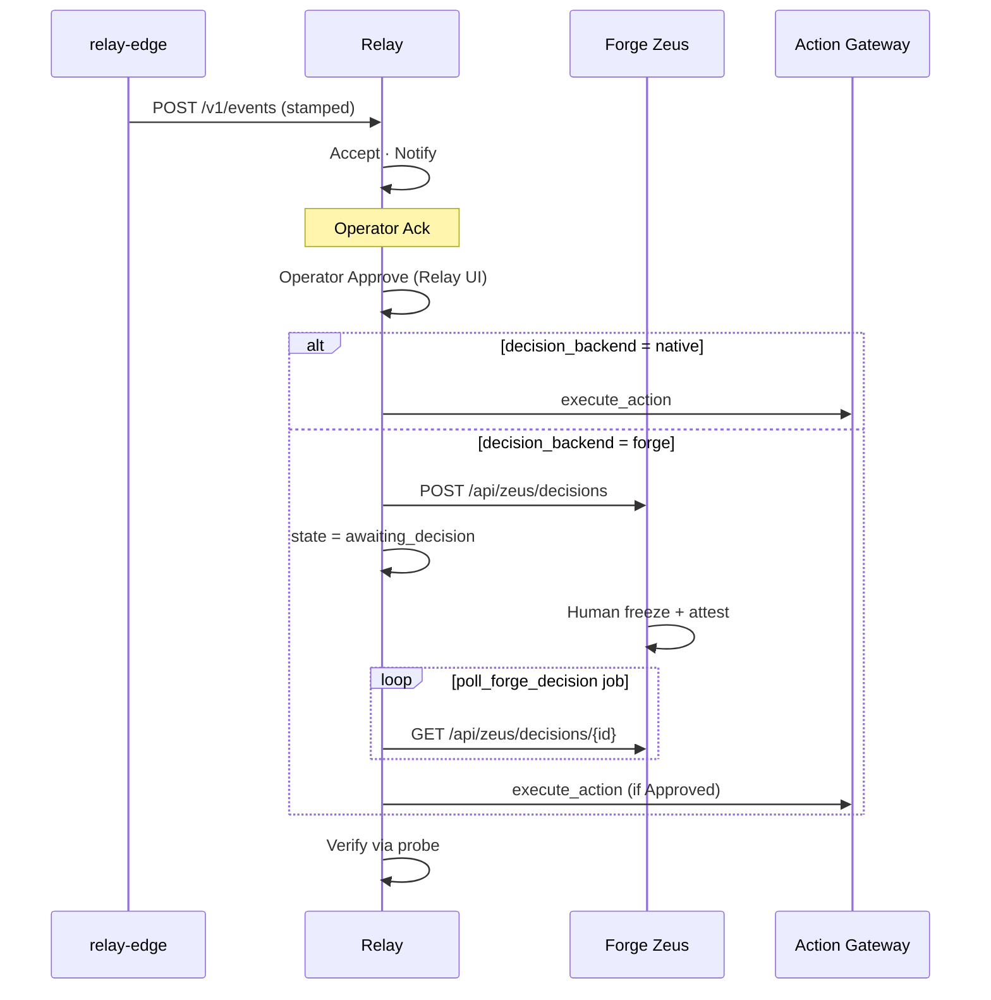

# relay-edge + Forge + Relay

How the three products work together at edge sites — event stamping, reliability loop, and optional human governance.

← [Docs hub](README.md) · [Working with Relay](RELAY.md) · Forge repo: [RELAY_STACK](https://github.com/zyvorai/forge/blob/main/docs/integrations/RELAY_STACK.md)

---

## One-minute summary

| Product | Job |
|---------|-----|
| **relay-edge** | Build **site-aware events** — farm domain, industrial plant, remote-edge NOC, multi-class fleet IoT — plus simulators and `/ui` control rooms |
| **Relay** | Make events **reliable** — notify, ack, act, verify, audit |
| **Forge** | Run **AI/K8s at the edge** and hold **Decision Records** when Relay policy requires human attestation |

relay-edge **never talks to Forge**. Relay **may** talk to Forge during approval. Forge **never** executes edge or plant actions — Relay’s Action Gateway does (farm, firewater, remote-edge, and fleet controller targets).

---

## Glossary (avoid naming confusion)

| Term | Meaning |
|------|---------|
| **relay-edge** | **This repo** — farm domain, simulators, stamped publishes (`:18086`) |
| **Relay** | Sibling [relay](https://github.com/zyvorai/relay) — notify/ack/act/verify loop |
| **Forge** | Sibling [forge](https://github.com/zyvorai/forge) — AI/K8s control plane; **not part of relay-edge** |
| **Forge edge site** | Physical/logical site where Forge runs GPU/federation workloads |
| **relay-pubsub** | Optional Pub/Sub gateway between relay-edge and Relay |
| **`decision_backend: forge`** | Relay policy value — Relay opens Forge Decision Records (API contract; do not rename) |

```text
  relay-edge ──publish──► relay-pubsub ──► Relay ──Act──► pubsub /v1/actions
                              ▲                              │
                              └──────── action loop ──────────┘

  (optional) Relay ──► Forge Decision Record  — only when Forge deployed + policy forge backend
```

---

## Architecture



**Optional fourth piece:** [relay-pubsub](https://github.com/zyvorai/relay-pubsub) sits between relay-edge and Relay when you want Google Pub/Sub SDKs or a shared Action Gateway at the edge.

Forge in the diagram above is **optional**. For the default three-service stack (no Forge), see **[Stack without Forge](#stack-without-forge-default)** below.

---

## Stack without Forge (default)

Most deployments are **relay-edge → relay-pubsub → Relay** only. Forge is not installed, not configured, and not contacted. relay-edge **never** calls Forge; Relay **never** opens Decision Records unless you explicitly set `decision_backend: forge` **and** `RELAY_FORGE_*` on Relay.

### What relay-edge covers (all families)

relay-edge is not farm-only. It stamps and publishes **four event families** (~40 types registered in relay-pubsub) plus a full **domain API**:

| Family | UI / API | What it models | Example event types |
|--------|----------|----------------|---------------------|
| **Farm** | Season API, `smoke.sh` | Sites, zones, devices, seasons, contacts, telemetry | `irrigation.required`, `crop.advisory`, `frost.alert` |
| **Firewater / edge IoT** | `/ui/firewater.html` — 47-point plant | NFPA plant, pumps/tanks, edge AI, gas, vision, comms | `firewater.tank.low`, `edge.vision.fire`, `edge.comms.down` |
| **Remote edge** | `/ui/remote-edge.html` | Starlink, Galleon GPU, SD-WAN, 5G, UAV, perimeter IoT | `remote-edge.link.offline`, `remote-edge.galleon.thermal` |
| **Fleet / multi-IoT** | `/ui/fleet.html` · `smoke-fleet.sh` — 77 devices / 18 classes | AMR, RTLS, wearables, energy, BMS, OT, marine, agri, security | `fleet.power.island`, `fleet.robot.lost`, `fleet.ot.ids` |

**Domain API (all families share):** sites, zones, devices, contacts, seasons, routing, telemetry probes, stages — JSON on disk, REST CRUD. Every publish runs **resolveEnrich** so Relay sees season/site/zone, recipients, `recommended_action`, and `verification_probe`.

**Extra industrial features (firewater):** interlocks (`/v1/firewater/act`), ISA-18.2 alarms, Sparkplug B, Modbus map, NFPA weekly test — see [Simulators](SIMULATORS.md) and [API](API.md).

**Transport:** all families use the same gateway path — `POST …/topics/{type}:publish` where topic name equals event type.

### What runs where

| Process | Port (typical) | Role when Forge absent |
|---------|----------------|-------------------------|
| **relay-edge** | `:18086` HTTP | Stamp season/site/zone/device; simulators; publish to gateway |
| **relay-pubsub** | `:8081` HTTPS | Pub/Sub REST in; map topic → event type; **Action Gateway** `POST /v1/actions` |
| **Relay** | `:8443` or `:18080` HTTPS | Accept · Notify · Ack · **Act** · Verify · audit log |
| ~~Forge~~ | — | **Not deployed** — omit `RELAY_FORGE_*`, leave `FORGE_*` empty in lab env |

Shared secret: one **`RELAY_AUTH_TOKEN`** (JWT) on relay-edge, relay-pubsub, and your test scripts. Relay signs it with `RELAY_JWT_SECRET`.

### Architecture (no Forge)

```mermaid
flowchart TB
  subgraph edge_site["Edge site — no Forge"]
    FE["relay-edge :18086\nseasons · sites · zones\nfirewater · remote-edge · fleet · /ui"]
    PS["relay-pubsub :8081 HTTPS\nrelay-events backend\n/v1/actions Action Gateway"]
  end

  RL["Zyvor Relay :8443/:18080 HTTPS\npolicies · notify · ack · act · verify"]

  OP["Operator\nRelay console / API"]

  FE -->|"① stamp + POST …/topics/{type}:publish\n(JWT in relay-pubsub env)"| PS
  PS -->|"② POST /v1/events\n(relay-events → Relay API)"| RL
  RL -->|"③ FCM / SMS / email"| OP
  OP -->|"④ POST …/events/{id}/ack\napprove"| RL
  RL -->|"⑤ POST /v1/actions\nfarm · firewater · remote-edge · fleet targets"| PS
  PS -->|"⑥ ack executed · provider_id rpg_*"| RL
  RL -->|"⑦ GET verification_probe URL\n(stamped by relay-edge)"| FE

  style FE fill:#1a2a3a
  style PS fill:#1a2a3a
  style RL fill:#2a1a1a
```



**Not in this diagram:** Forge Zeus, `POST /api/zeus/decisions`, `awaiting_decision`, or `poll_forge_decision`. Those exist only when Forge is co-located and policy uses `decision_backend: forge`.

### End-to-end sequences (native approval — no Forge)

All four families share steps ①→② (stamp + publish → Accept). **Act** uses the controller target stamped in `recommended_action` (`farm-controller`, `firewater-controller`, `remote-edge-controller`, or `fleet-controller`).

#### A. Farm critical — catalog / season API

Policy `pol_critical_farm`, **`decision_backend: native`**. Operator approves in Relay → Act immediately.



#### B. Firewater / edge IoT — industrial UI

From `/ui`: seed plant → enable publish → scenario (e.g. `vision`, `gas`, `comms`).



#### C. Remote edge — distributed site NOC

From `/ui/remote-edge.html`: Starlink, Galleon thermal, UAV, perimeter IoT.



#### D. Fleet — multi-class IoT catalog

From `/ui/fleet.html`: 77 devices across 18 classes — AMR, energy, OT, BMS, marine, security, agri, …



**Advisory farm events** (`pol_advisory`): Accept + Notify only — no Act (`crop.advisory`, `weather.advisory`, …).

**Simulator publish path:** firewater, remote-edge, and fleet scenarios set `"publish": true` in config; relay-edge stamps the shared industrial season context before gateway publish.

### Relay state machine (no Forge)



You will **not** see `awaiting_decision` unless `decision_backend: forge` **and** Relay has working `RELAY_FORGE_*`.

### Configuration (no Forge)

Any peer may be remote — use host URLs, not laptop `127.0.0.1`.

**relay-edge:**

```bash
# Gateway path (pubsub remote or local):
GATEWAY_BASE_URL=https://<pubsub-host>:8081
RELAY_AUTH_TOKEN=<jwt>
RELAY_TLS_INSECURE=1

# Direct path (no pubsub):
# GATEWAY_BASE_URL=
# RELAY_BASE_URL=https://<relay-host>:8443   # or :18080
```

**relay-pubsub** (`/etc/relay-pubsub/relay-pubsub.env` or k8s secret):

```bash
RELAY_BACKEND=relay-events
RELAY_BASE_URL=https://<relay-host>:8443   # remote Relay OK; 127.0.0.1 only if co-located
RELAY_AUTH_TOKEN=<same-jwt>
RELAY_TLS_INSECURE=1
PUBSUB_TLS_SAN=localhost,127.0.0.1,<pubsub-host>,<names Relay will use>,relay-pubsub
```

**Relay** (process env — **do not set Forge vars**):

```bash
# Co-located pubsub:
RELAY_ACTION_TARGETS=farm-controller=https://127.0.0.1:8081/v1/actions,\
firewater-controller=https://127.0.0.1:8081/v1/actions,\
remote-edge-controller=https://127.0.0.1:8081/v1/actions,\
fleet-controller=https://127.0.0.1:8081/v1/actions
# Remote pubsub — swap 127.0.0.1 for <pubsub-host> and include that name in PUBSUB_TLS_SAN
RELAY_TLS_INSECURE=1    # outbound Act HTTPS to self-signed pubsub
# RELAY_FORGE_BASE_URL=   ← leave unset
# RELAY_FORGE_API_KEY=    ← leave unset
```

After Relay restart, re-sync pubsub `RELAY_AUTH_TOKEN` or gateway publish returns `relay 401 Unauthorized`.

### Policies and action targets (default demo)

| Family | Policy / routing | Act? | Action target | Example command |
|--------|------------------|------|---------------|-----------------|
| Farm critical (×5) | `pol_critical_farm` | Yes — ack then Act | `farm-controller` | `irrigation.start`, `pump.start`, … |
| Farm advisory (×5) | `pol_advisory` | Notify only | — | — |
| Firewater / edge | Matched by type + severity | When stamped + ack | `firewater-controller` | `deluge.activate`, `pump.start`, … |
| Remote edge | Matched by type + severity | When stamped + ack | `remote-edge-controller` | site-specific payloads |
| Fleet / multi-IoT | Matched by type + severity | When stamped + ack | `fleet-controller` | `security.lockdown`, `ot.segment`, … |

All four targets point at the same pubsub Action Gateway URL in lab config; Relay picks target from `recommended_action.target` in the stamped event.

### Verify (no Forge)

```bash
cp config/lab-stack.env.example config/lab-stack.env
# BASE, GATEWAY, EDGE, RELAY_AUTH_TOKEN — FORGE_* empty

set -a && source config/lab-stack.env && set +a
./scripts/e2e-stack.sh
```

Covers all four families: health probe → **A.** farm 10 Accept (+ Act when Relay→gateway TLS is trusted) → **B.** firewater 5 → **C.** remote-edge **6** (incl. `drone_patrol`) → **D.** fleet 6. See [EVENT_MATRIX.md](EVENT_MATRIX.md) and [TEST_RESULTS.md](TEST_RESULTS.md).

### When you add Forge later

Same publish path (①→②). Only the **approval branch** changes: after operator Approve in Relay, Relay opens a Forge Decision Record and waits for freeze/attest before Act. → [Path 2 — Approvals](#path-2--approvals-when-policy-requires-it) · [`e2e-forge-stack.sh`](../scripts/e2e-forge-stack.sh)

---

## Division of labor

| Concern | relay-edge | Relay | Forge |
|---------|------------|-------|-------|
| Seasons, sites, zones, devices | ✅ | — | — |
| Industrial / remote-edge simulators | ✅ | — | — |
| Stamping `data` (recipients, probes) | ✅ | — | — |
| Durable event log + policies | — | ✅ | — |
| Notify / SMS / FCM / email | — | ✅ | — |
| Operator ack in Relay UI | — | ✅ | — |
| Execute `irrigation.start`, `pump.start`, … | — | ✅ (Action Gateway) | — |
| Verification probes | stamps URL | runs verify job | — |
| GPU training, federated LoRA | — | — | ✅ |
| Zeus copilot, War Room | — | — | ✅ |
| Decision Record (evidence + attestation) | — | opens via API | ✅ stores + UI |
| Publish events | ✅ | receives | — |

Relay policies match on **`type` + `severity`**. relay-edge ensures every payload is **context-rich** before Accept.

---

## Two paths through Relay

### Path 1 — Events (always)

Every operational signal follows this path regardless of Forge:

```text
1. Trigger          Farm season API · firewater/remote-edge/fleet UI · smoke · real SCADA/IoT
2. relay-edge       resolveEnrich → stampData → publishSimEvent / season publish
3. Transport        relay-pubsub (topic = type)  OR  POST Relay /v1/events
4. Relay Accept     policy match · idempotency · persist
5. Relay Notify     FCM/SMS/email from stamped recipients
6. Relay Ack        human or auto
7. Relay Act        if critical + recommended_action (and approval satisfied)
8. Relay Verify     HTTP probe from stamped verification_probe
```

Example stamped fields relay-edge adds (Relay sees these in `data`):

| Field | Purpose |
|-------|---------|
| `season_id`, `site_id`, `zone_id` | Site topology |
| `recipient`, `sms_recipient` | Notify targets |
| `verification_probe` | Act → Verify evidence |
| `recommended_action` | `{ target, command, payload }` for Action Gateway |
| `sim_domain` | `firewater`, `remote-edge`, or `fleet` |

### Path 2 — Approvals (when policy requires it)

After Notify + Ack, **critical** events with `require_approval: true` branch:

| `decision_backend` | What happens before Act |
|--------------------|-------------------------|
| **`native`** (default) | Operator clicks **Approve** in Relay → Act immediately |
| **`forge`** | Operator **Approve** in Relay → Relay opens Forge Decision Record → event **`awaiting_decision`** → human **freeze + attest** in Forge Zeus → Relay polls → Act only if `Frozen` + `Approved` |



**Fail closed:** if `decision_backend=forge` and Forge is down or misconfigured, Relay does **not** act.

---

## What relay-edge publishes

Four event families (40 types pre-registered in relay-pubsub):

| Family | Source | Example `type` |
|--------|--------|----------------|
| Farm | Season API, `./scripts/smoke.sh` | `irrigation.required` |
| Firewater / edge | `/ui`, `./scripts/smoke-firewater.sh` | `firewater.tank.low`, `edge.comms.down` |
| Remote edge | `/ui/remote-edge.html`, `./scripts/smoke-remote-edge.sh` | `remote-edge.link.offline` |
| Fleet | `/ui/fleet.html`, `./scripts/smoke-fleet.sh` | `fleet.power.island` |

Simulator publish requires:

1. `POST /v1/firewater/seed` (shared industrial season)
2. `POST /v1/{simulator}/config` with `"publish": true`
3. Scenario or start stream

Full matrix → [EVENT_MATRIX.md](EVENT_MATRIX.md)

---

## What Forge adds at the same site

Forge runs **compute and governance** independently of relay-edge:

| Forge capability | Typical edge use |
|------------------|------------------|
| `FabricAIJob` | Inference/training on local GPUs |
| `FabricFederatedTrainingRun` | LoRA at each federation member |
| `FabricDatabaseMigration` | Cloud DB → edge Postgres cutover |
| `FabricFederation` | Multi-site cluster registry |
| Zeus + Decision Records | Human-gated recommendations |

**Correlation, not coupling:** when federated training fails on `edge-a`, Forge handles recovery phases; relay-edge (or monitoring) can **separately** emit `remote-edge.link.offline` or `fleet.robot.lost` so Relay escalates ops. Tie them together with shared **site labels** in event `data` and Forge cluster names in your runbooks.

---

## Configuration by service

### relay-edge (this repo)

| Variable | Purpose |
|----------|---------|
| `GATEWAY_BASE_URL` | relay-pubsub HTTPS (`""` = direct Relay) |
| `RELAY_BASE_URL` | Relay `/v1/events` for direct mode |
| `RELAY_AUTH_TOKEN` | JWT — **must match** pubsub + Relay |
| `RELAY_TLS_INSECURE` | Trust lab self-signed certs |

No Forge variables on relay-edge.

```bash
export GATEWAY_BASE_URL=https://127.0.0.1:8081
export RELAY_AUTH_TOKEN="$(cat /tmp/lab-relay.jwt)"
export RELAY_TLS_INSECURE=1
go run ./cmd/relay-edge
```

### relay-pubsub (optional)

| Variable | Purpose |
|----------|---------|
| `RELAY_BACKEND` | `relay-events` for production |
| `RELAY_BASE_URL` | Upstream Relay |
| `RELAY_AUTH_TOKEN` | Same JWT as edge |

Registers farm + edge + remote-edge + fleet catalogs at startup. Also hosts **Action Gateway** inbound (`POST /v1/actions`).

### Relay

| Variable | Purpose |
|----------|---------|
| `RELAY_ACTION_TARGETS` | Map controller names → gateway `/v1/actions` |
| `RELAY_TLS_INSECURE` | Skip TLS verify on outbound **action** HTTPS (lab self-signed pubsub cert) |
| `RELAY_FORGE_BASE_URL` | Forge API gateway (Decision Records) |
| `RELAY_FORGE_API_KEY` | Gateway secret |

Action targets example:

```bash
RELAY_ACTION_TARGETS=farm-controller=https://127.0.0.1:8081/v1/actions,\
firewater-controller=https://127.0.0.1:8081/v1/actions,\
remote-edge-controller=https://127.0.0.1:8081/v1/actions,\
fleet-controller=https://127.0.0.1:8081/v1/actions
```

Forge (optional):

```bash
RELAY_FORGE_BASE_URL=http://127.0.0.1:30631
RELAY_FORGE_API_KEY=$(kubectl -n forge get secret forge-api-gateway-secret \
  -o jsonpath='{.data.api-key}' | base64 -d)
```

Policy for Forge-gated acts:

```json
{
  "event_types": ["irrigation.required"],
  "severities": ["critical"],
  "require_approval": true,
  "decision_backend": "forge",
  "verify_action": true
}
```

### Forge

Relay calls these gateway routes (implemented in Relay [`internal/forge`](https://github.com/zyvorai/relay/tree/main/backend/internal/forge)):

| Method | Route | Caller |
|--------|-------|--------|
| `POST` | `/api/zeus/decisions` | Relay (on operator approve) |
| `GET` | `/api/zeus/decisions/{id}` | Relay `poll_forge_decision` job |

Human steps happen in **Forge Web UI** (Zeus): research evidence → **freeze** → **attest** (Approved / Rejected).

Record is actionable when `phase=Frozen` and `decision=Approved`.

---

## Lab wiring (remote-capable stack)

**Relay, relay-pubsub, and relay-edge may each run on a different host.** Wire every process to the peer’s reachable URL. When you run `e2e-stack.sh` from your laptop, `BASE` / `GATEWAY` / `EDGE` must be those remote URLs — **`127.0.0.1` is wrong** (it only talks to your laptop).

| Who → whom | Env / script var | `127.0.0.1` OK? |
|------------|------------------|-----------------|
| Laptop → Relay / pubsub / edge | `BASE`, `GATEWAY`, `EDGE` | **No** — use host IPs |
| edge → pubsub | `GATEWAY_BASE_URL` | Only if pubsub is on the edge host |
| pubsub → Relay | `RELAY_BASE_URL` (pubsub) | Only if Relay is on the pubsub host |
| Relay → `/v1/actions` | `RELAY_ACTION_TARGETS` | Only if pubsub is on the Relay host |

Example all-on-one labs (from your laptop still use the public IP):

| Lab host | Relay | pubsub | console | edge |
|----------|-------|--------|---------|------|
| `212.8.248.187` | `:8443` | `:8081` | `:8082` | `:18086` |
| `175.110.122.71` | `:18080` | `:8081` | `:8082` | `:18086` |

| Service | URL pattern | Repo |
|---------|-------------|------|
| relay-edge | `https://<edge-host>:18086` | relay-edge |
| relay-pubsub | `https://<pubsub-host>:8081` | relay-pubsub |
| console | `https://<pubsub-host>:8082/` | relay-pubsub |
| Relay | `https://<relay-host>:8443` or `:18080` | relay |
| Forge UI | `http://<forge-host>:30862` | forge |
| Forge gateway | `http://<forge-host>:30631` | forge |

### Checklist

1. Issue Relay JWT → set on relay-edge + relay-pubsub (wherever they run).
2. Start Relay with `RELAY_ACTION_TARGETS` pointing at the **reachable** pubsub `/v1/actions` and `RELAY_TLS_INSECURE=1` when using self-signed TLS.
3. Start relay-pubsub (`RELAY_BACKEND=relay-events`, `RELAY_BASE_URL` → Relay host).
4. Start relay-edge (`GATEWAY_BASE_URL` → pubsub host).
5. (Optional) Set `RELAY_FORGE_*` on Relay + create forge-backed policy.
6. Seed edge: `curl -k -X POST https://<edge-host>:18086/v1/firewater/seed`.
7. From your workstation: `BASE`/`GATEWAY`/`EDGE` = those remote URLs → `./scripts/e2e-stack.sh`.

---

## Simulate all (one command)

### Without Forge (typical edge stack)

```bash
cp config/lab-stack.env.example config/lab-stack.env
# or lab 175: cp config/lab-stack-175.env.example config/lab-stack-175.env
# Edit: BASE, GATEWAY, EDGE, RELAY_AUTH_TOKEN — leave FORGE_* empty

set -a && source config/lab-stack.env && set +a
./scripts/e2e-stack.sh
```

### Direct Relay (no pubsub)

When relay-edge publishes straight to Relay (`GATEWAY_BASE_URL=` on the edge process):

```bash
cp config/lab-direct.env.example config/lab-direct.env
# BASE, EDGE, RELAY_AUTH_TOKEN

RELAY_EDGE_DIRECT=1 RELAY_AUTH_TOKEN=<jwt> ./scripts/deploy-remote.sh <HOST> [USER]

set -a && source config/lab-direct.env && set +a
./scripts/e2e-direct-stack.sh
```

Accept-only gate (Act still needs pubsub Action Gateway). See [TEST_RESULTS — Direct Relay](TEST_RESULTS.md#direct-relay-tested-2026-08-28).

### With Forge (optional Decision Records)

```bash
cp config/lab-stack.env.example config/lab-stack.env
# Edit: RELAY_AUTH_TOKEN, FORGE_BASE, FORGE_API_KEY
# Ensure Relay process has RELAY_FORGE_BASE_URL + RELAY_FORGE_API_KEY

set -a && source config/lab-stack.env && set +a
./scripts/stack-probe.sh
./scripts/e2e-forge-stack.sh
```

| Script | What it runs |
|--------|----------------|
| [`e2e-stack.sh`](../scripts/e2e-stack.sh) | **No Forge** — probe + full event matrix (via pubsub) |
| [`e2e-direct-stack.sh`](../scripts/e2e-direct-stack.sh) | **Direct Relay** — probe + expanded matrix (no pubsub) |
| [`e2e-direct-relay.sh`](../scripts/e2e-direct-relay.sh) | Direct scenario matrix only |
| [`stack-probe.sh`](../scripts/stack-probe.sh) | Health: edge, pubsub, Relay, optional Forge API |
| [`stack-probe.sh --direct`](../scripts/stack-probe.sh) | Health: edge + Relay only |
| [`e2e-forge-stack.sh`](../scripts/e2e-forge-stack.sh) | Event matrix + Forge phases when `FORGE_*` set |
| [`e2e-events-matrix.sh`](../scripts/e2e-events-matrix.sh) | Event families only (no health probe) |

Flags:

- `./scripts/stack-probe.sh --forge-optional` — pass when Forge is not deployed
- `./scripts/stack-probe.sh --direct` — edge + Relay only (direct mode)
- `./scripts/e2e-forge-stack.sh --skip-matrix` — Forge approval path only

If `FORGE_BASE` / `FORGE_API_KEY` are unset, `e2e-forge-stack.sh` runs phase A only and skips Forge phases with a clear message.

**Latest lab re-run (2026-08-29):** labs **212** and **175** gateway **PASS** (incl. farm 5/5 Act) — [TEST_RESULTS.md](TEST_RESULTS.md) · [/ui/docs.html](/ui/docs.html). Act wiring helper: [`lab-wire-relay-act.sh`](../scripts/lab-wire-relay-act.sh).

Env templates: [`config/lab-stack.env.example`](../config/lab-stack.env.example) · [`config/lab-stack-175.env.example`](../config/lab-stack-175.env.example)

---

## Walkthroughs

### A. Demo stack — no Forge (15 min)

```bash
# 1. relay-edge
go run ./cmd/relay-edge

# 2. Open http://127.0.0.1:18086/ui/remote-edge.html
#    Seed → Publish into Relay → scenario "Site offline"

# 3. Verify all four families (needs Relay + pubsub running)
BASE=https://<relay>:8443 GATEWAY=https://<gw>:8081 EDGE=https://<edge>:18086 \
  ./scripts/e2e-events-matrix.sh
```

### B. Farm critical event — native approval

```bash
./scripts/smoke.sh   # creates site/season, publishes irrigation.required
# Relay console: Ack → Approve → watch Act → Verify
```

### C. Farm critical event — Forge Decision Record

Prerequisites: Relay `RELAY_FORGE_*` set, policy with `decision_backend: forge`.

```bash
# relay-edge publishes (same as B)
./scripts/smoke.sh

# Relay repo — dedicated test policy + forge freeze flow
FORGE_BASE=http://<forge-host>:30631 FORGE_API_KEY=… \
  BASE=https://<relay-host>:8443 \   # or :18080 on lab 175
  ./scripts/decision-backend-scenarios.sh
```

Steps in UI:

1. relay-edge → Relay: event `accepted` → `notified`.
2. Relay console: **Ack** → **Approve** (opens Forge DR, Relay → `awaiting_decision`).
3. Forge Zeus: open Decision Record → **freeze** → **attest Approved**.
4. Relay polls → **Act** → **Verify**.

### D. Forge GPU site + relay-edge ops (correlated)

```text
Forge: FabricFederatedTrainingRun on edge-a enters recovery (site timeout)
relay-edge: fleet scenario "blackout" → fleet.power.island
Relay: both events in timeline; on-call uses Forge War Room + Relay console
```

No automatic link — design **site_id** / cluster name consistently in both systems.

---

## Relay event states (Forge branch)

| State | Meaning |
|-------|---------|
| `accepted` | Stored, policy matched |
| `notified` | Delivery attempted |
| `awaiting_decision` | Forge Decision Record open (`decision_backend=forge`) |
| `acted` | Action Gateway invoked |
| `verified` | Probe succeeded |
| `failed` | Rejected or Forge attestation denied |
| `escalated` | Ack window exhausted |

Forge fields on the event: `forge_decision_record_id`, tags for phase/decision.

---

## When to use which product

| Goal | Use |
|------|-----|
| Stamp farm/site context on events | **relay-edge** |
| Demo remote edge without hardware | **relay-edge** `/ui`, `/ui/remote-edge.html` |
| Never lose an accepted event / closed-loop act | **Relay** |
| Pub/Sub SDKs at edge | **relay-pubsub** + relay-edge |
| GPU training / inference at site | **Forge** |
| Federated fine-tune across factories | **Forge** |
| Compliance audit trail before critical act | **Relay** policy + **Forge** Decision Records |
| Actually run irrigation/pump/site commands | **Relay** Action Gateway (never Forge) |

---

## Troubleshooting

| Symptom | Check |
|---------|-------|
| Events never reach Relay | `GATEWAY_BASE_URL`, JWT, `RELAY_TLS_INSECURE`, pubsub health |
| `relay 401 Unauthorized` from gateway | Re-sync `RELAY_AUTH_TOKEN` on pubsub after Relay restart (`demo` login JWT) |
| Farm Act `failed` / circuit breaker | Relay `RELAY_TLS_INSECURE=1` + Act targets pointing at **reachable** pubsub `/v1/actions` (remote host if not co-located) |
| e2e / curl hits laptop instead of lab | Do not use `127.0.0.1` in `BASE`/`GATEWAY`/`EDGE` from your workstation |
| `publish.path` is not `relay` in direct mode | Set `GATEWAY_BASE_URL=` **explicitly** (unset uses gateway default); use `RELAY_EDGE_DIRECT=1` deploy |
| Act never fires | `RELAY_ACTION_TARGETS`, gateway `/v1/actions`, `recommended_action` in stamp |
| Stuck `awaiting_decision` | Forge gateway reachable; human froze + attested Approved |
| Forge path fails closed on approve | `RELAY_FORGE_BASE_URL` + API key on Relay |
| Simulator publish no-op | `POST /v1/firewater/seed` first; `"publish": true` in config |
| Verify fails | Zone telemetry URL in stamp; probe returns expected JSON |

---

## Related documentation

| Topic | Document |
|-------|----------|
| Publish paths, wire format | [RELAY.md](RELAY.md) |
| Stamping, simulators | [CONCEPTS.md](CONCEPTS.md) · [SIMULATORS.md](SIMULATORS.md) |
| Integration test gate | [EVENT_MATRIX.md](EVENT_MATRIX.md) |
| Deploy, ports, TLS | [DEPLOYMENT.md](DEPLOYMENT.md) |
| Relay approval backends | [relay ARCHITECTURE](https://github.com/zyvorai/relay/blob/main/docs/ARCHITECTURE.md#approval-backends-native-vs-forge) |
| Forge-side integration | [forge RELAY_STACK](https://github.com/zyvorai/forge/blob/main/docs/integrations/RELAY_STACK.md) |
| Forge advisory vs actuation | [forge ADVISORY_LEDGER](https://github.com/zyvorai/forge/blob/main/docs/product/ADVISORY_LEDGER.md) |

---

## Summary

```text
relay-edge  = WHAT happened (stamped, site-aware events)
Relay       = THAT it was handled reliably (notify · ack · act · verify)
Forge       = WHO attested (optional Decision Record before act)
              + WHERE compute runs (GPU/K8s at the edge)
```

Three products, one edge site: **relay-edge feeds Relay; Relay may ask Forge for human governance; Relay always executes.**
