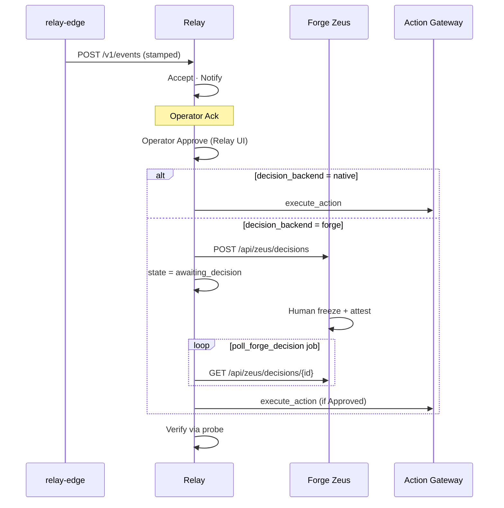

# relay-edge + Forge + Relay

How the three products work together at edge sites — event stamping, reliability loop, and optional human governance.

← [Docs hub](README.md) · [Working with Relay](RELAY.md) · Forge repo: [RELAY_STACK](https://github.com/zyvorai/forge/blob/main/docs/integrations/RELAY_STACK.md)

---

## One-minute summary

| Product | Job |
|---------|-----|
| **relay-edge** | Build **site-aware events** (farm domain, simulators, `/ui`) and publish them |
| **Relay** | Make events **reliable** — notify, ack, act, verify, audit |
| **Forge** | Run **AI/K8s at the edge** and hold **Decision Records** when Relay policy requires human attestation |

relay-edge **never talks to Forge**. Relay **may** talk to Forge during approval. Forge **never** executes farm or plant actions — Relay’s Action Gateway does.

---

## Glossary (avoid naming confusion)

| Term | Meaning |
|------|---------|
| **relay-edge** | **This repo** — farm domain, simulators, stamped publishes (`:18086`) |
| **Relay** | Sibling [relay](https://github.com/zyvorai/relay) — notify/ack/act/verify loop |
| **Forge** | Sibling [forge](https://github.com/zyvorai/forge) — AI/K8s control plane; **not part of relay-edge** |
| **Forge edge site** | Physical/logical site where Forge runs GPU/federation workloads |
| **relay-pubsub** | Optional Pub/Sub gateway between relay-edge and Relay |
| **`decision_backend: forge`** | Relay policy value — Relay opens Forge Decision Records (API contract; do not rename) |

```text
  relay-edge ──publish──► Relay ──optional──► Forge (Decision Record)
                              │
                              └── Act ──► controllers / simulators
```

---

## Architecture


**Optional fourth piece:** [relay-pubsub](https://github.com/zyvorai/relay-pubsub) sits between relay-edge and Relay when you want Google Pub/Sub SDKs or a shared Action Gateway at the edge.

---

## Division of labor

| Concern | relay-edge | Relay | Forge |
|---------|------------|-------|-------|
| Seasons, sites, zones, devices | ✅ | — | — |
| Industrial / remote-edge simulators | ✅ | — | — |
| Stamping `data` (recipients, probes) | ✅ | — | — |
| Durable event log + policies | — | ✅ | — |
| Notify / SMS / FCM / email | — | ✅ | — |
| Operator ack in Relay UI | — | ✅ | — |
| Execute `irrigation.start`, `pump.start`, … | — | ✅ (Action Gateway) | — |
| Verification probes | stamps URL | runs verify job | — |
| GPU training, federated LoRA | — | — | ✅ |
| Zeus copilot, War Room | — | — | ✅ |
| Decision Record (evidence + attestation) | — | opens via API | ✅ stores + UI |
| Publish events | ✅ | receives | — |

Relay policies match on **`type` + `severity`**. relay-edge ensures every payload is **context-rich** before Accept.

---

## Two paths through Relay

### Path 1 — Events (always)

Every operational signal follows this path regardless of Forge:

```text
1. Trigger          UI scenario · farm API · smoke script · real SCADA
2. relay-edge       resolveEnrich → stampData → publishSimEvent / season publish
3. Transport        relay-pubsub (topic = type)  OR  POST Relay /v1/events
4. Relay Accept     policy match · idempotency · persist
5. Relay Notify     FCM/SMS/email from stamped recipients
6. Relay Ack        human or auto
7. Relay Act        if critical + recommended_action (and approval satisfied)
8. Relay Verify     HTTP probe from stamped verification_probe
```

Example stamped fields relay-edge adds (Relay sees these in `data`):

| Field | Purpose |
|-------|---------|
| `season_id`, `site_id`, `zone_id` | Site topology |
| `recipient`, `sms_recipient` | Notify targets |
| `verification_probe` | Act → Verify evidence |
| `recommended_action` | `{ target, command, payload }` for Action Gateway |
| `sim_domain` | `firewater`, `remote-edge`, or `fleet` |

### Path 2 — Approvals (when policy requires it)

After Notify + Ack, **critical** events with `require_approval: true` branch:

| `decision_backend` | What happens before Act |
|--------------------|-------------------------|
| **`native`** (default) | Operator clicks **Approve** in Relay → Act immediately |
| **`forge`** | Operator **Approve** in Relay → Relay opens Forge Decision Record → event **`awaiting_decision`** → human **freeze + attest** in Forge Zeus → Relay polls → Act only if `Frozen` + `Approved` |



**Fail closed:** if `decision_backend=forge` and Forge is down or misconfigured, Relay does **not** act.

---

## What relay-edge publishes

Four event families (40 types pre-registered in relay-pubsub):

| Family | Source | Example `type` |
|--------|--------|----------------|
| Farm | Season API, `./scripts/smoke.sh` | `irrigation.required` |
| Firewater / edge | `/ui`, firewater API | `firewater.tank.low`, `edge.comms.down` |
| Remote edge | `/ui/remote-edge.html` | `remote-edge.link.offline` |
| Fleet | `/ui/fleet.html` | `fleet.power.island` |

Simulator publish requires:

1. `POST /v1/firewater/seed` (shared industrial season)
2. `POST /v1/{simulator}/config` with `"publish": true`
3. Scenario or start stream

Full matrix → [EVENT_MATRIX.md](EVENT_MATRIX.md)

---

## What Forge adds at the same site

Forge runs **compute and governance** independently of relay-edge:

| Forge capability | Typical edge use |
|------------------|------------------|
| `FabricAIJob` | Inference/training on local GPUs |
| `FabricFederatedTrainingRun` | LoRA at each federation member |
| `FabricDatabaseMigration` | Cloud DB → edge Postgres cutover |
| `FabricFederation` | Multi-site cluster registry |
| Zeus + Decision Records | Human-gated recommendations |

**Correlation, not coupling:** when federated training fails on `edge-a`, Forge handles recovery phases; relay-edge (or monitoring) can **separately** emit `remote-edge.link.offline` or `fleet.robot.lost` so Relay escalates ops. Tie them together with shared **site labels** in event `data` and Forge cluster names in your runbooks.

---

## Configuration by service

### relay-edge (this repo)

| Variable | Purpose |
|----------|---------|
| `GATEWAY_BASE_URL` | relay-pubsub HTTPS (`""` = direct Relay) |
| `RELAY_BASE_URL` | Relay `/v1/events` for direct mode |
| `RELAY_AUTH_TOKEN` | JWT — **must match** pubsub + Relay |
| `RELAY_TLS_INSECURE` | Trust lab self-signed certs |

No Forge variables on relay-edge.

```bash
export GATEWAY_BASE_URL=https://127.0.0.1:8081
export RELAY_AUTH_TOKEN="$(cat /tmp/lab-relay.jwt)"
export RELAY_TLS_INSECURE=1
go run ./cmd/relay-edge
```

### relay-pubsub (optional)

| Variable | Purpose |
|----------|---------|
| `RELAY_BACKEND` | `relay-events` for production |
| `RELAY_BASE_URL` | Upstream Relay |
| `RELAY_AUTH_TOKEN` | Same JWT as edge |

Registers farm + edge + remote-edge + fleet catalogs at startup. Also hosts **Action Gateway** inbound (`POST /v1/actions`).

### Relay

| Variable | Purpose |
|----------|---------|
| `RELAY_ACTION_TARGETS` | Map controller names → gateway `/v1/actions` |
| `RELAY_FORGE_BASE_URL` | Forge API gateway (Decision Records) |
| `RELAY_FORGE_API_KEY` | Gateway secret |

Action targets example:

```bash
RELAY_ACTION_TARGETS=farm-controller=https://127.0.0.1:8081/v1/actions,\
firewater-controller=https://127.0.0.1:8081/v1/actions,\
remote-edge-controller=https://127.0.0.1:8081/v1/actions,\
fleet-controller=https://127.0.0.1:8081/v1/actions
```

Forge (optional):

```bash
RELAY_FORGE_BASE_URL=http://127.0.0.1:30631
RELAY_FORGE_API_KEY=$(kubectl -n forge get secret forge-api-gateway-secret \
  -o jsonpath='{.data.api-key}' | base64 -d)
```

Policy for Forge-gated acts:

```json
{
  "event_types": ["irrigation.required"],
  "severities": ["critical"],
  "require_approval": true,
  "decision_backend": "forge",
  "verify_action": true
}
```

### Forge

Relay calls these gateway routes (implemented in Relay [`internal/forge`](https://github.com/zyvorai/relay/tree/main/backend/internal/forge)):

| Method | Route | Caller |
|--------|-------|--------|
| `POST` | `/api/zeus/decisions` | Relay (on operator approve) |
| `GET` | `/api/zeus/decisions/{id}` | Relay `poll_forge_decision` job |

Human steps happen in **Forge Web UI** (Zeus): research evidence → **freeze** → **attest** (Approved / Rejected).

Record is actionable when `phase=Frozen` and `decision=Approved`.

---

## Lab wiring (co-deployed stack)

Example host **`212.8.248.187`** — all services on one machine:

| Service | URL | Repo |
|---------|-----|------|
| relay-edge | `http://212.8.248.187:18086` | relay-edge |
| relay-pubsub | `https://212.8.248.187:8081` | relay-pubsub |
| Relay | `https://212.8.248.187:8443` | relay |
| Forge UI | `http://212.8.248.187:30862` | forge |
| Forge gateway | `http://212.8.248.187:30631` | forge |

### Checklist

1. Issue Relay JWT → set on relay-edge + relay-pubsub.
2. Start Relay with `RELAY_ACTION_TARGETS` pointing at pubsub.
3. Start relay-pubsub (`RELAY_BACKEND=relay-events`).
4. Start relay-edge (`GATEWAY_BASE_URL` → pubsub).
5. (Optional) Set `RELAY_FORGE_*` on Relay + create forge-backed policy.
6. Seed edge: `curl -X POST http://<edge>:18086/v1/firewater/seed`.

---

## Simulate all (one command)

From this repo, after the lab stack is running:

```bash
cp config/lab-stack.env.example config/lab-stack.env
# Edit: RELAY_AUTH_TOKEN, FORGE_API_KEY
# Ensure Relay process has RELAY_FORGE_BASE_URL + RELAY_FORGE_API_KEY

set -a && source config/lab-stack.env && set +a
./scripts/stack-probe.sh --forge-optional   # health check
./scripts/e2e-forge-stack.sh                # full simulation
```

| Script | What it runs |
|--------|----------------|
| [`stack-probe.sh`](../scripts/stack-probe.sh) | Health: edge, pubsub, Relay, optional Forge API |
| [`e2e-forge-stack.sh`](../scripts/e2e-forge-stack.sh) | Phase A: event matrix · Phases B–G: relay-edge → Relay → Forge freeze → act |
| [`e2e-events-matrix.sh`](../scripts/e2e-events-matrix.sh) | Event families only (no Forge path) |

Flags:

- `./scripts/stack-probe.sh --forge-optional` — pass when Forge is not deployed
- `./scripts/e2e-forge-stack.sh --skip-matrix` — Forge approval path only

If `FORGE_BASE` / `FORGE_API_KEY` are unset, `e2e-forge-stack.sh` runs phase A only and skips Forge phases with a clear message.

Env template: [`config/lab-stack.env.example`](../config/lab-stack.env.example)

---

## Walkthroughs

### A. Demo stack — no Forge (15 min)

```bash
# 1. relay-edge
go run ./cmd/relay-edge

# 2. Open http://127.0.0.1:18086/ui/remote-edge.html
#    Seed → Publish into Relay → scenario "Site offline"

# 3. Verify all four families (needs Relay + pubsub running)
BASE=https://<relay>:8443 GATEWAY=https://<gw>:8081 EDGE=http://<edge>:18086 \
  ./scripts/e2e-events-matrix.sh
```

### B. Farm critical event — native approval

```bash
./scripts/smoke.sh   # creates site/season, publishes irrigation.required
# Relay console: Ack → Approve → watch Act → Verify
```

### C. Farm critical event — Forge Decision Record

Prerequisites: Relay `RELAY_FORGE_*` set, policy with `decision_backend: forge`.

```bash
# relay-edge publishes (same as B)
./scripts/smoke.sh

# Relay repo — dedicated test policy + forge freeze flow
FORGE_BASE=http://212.8.248.187:30631 FORGE_API_KEY=… \
  BASE=https://212.8.248.187:8443 \
  ./scripts/decision-backend-scenarios.sh
```

Steps in UI:

1. relay-edge → Relay: event `accepted` → `notified`.
2. Relay console: **Ack** → **Approve** (opens Forge DR, Relay → `awaiting_decision`).
3. Forge Zeus: open Decision Record → **freeze** → **attest Approved**.
4. Relay polls → **Act** → **Verify**.

### D. Forge GPU site + relay-edge ops (correlated)

```text
Forge: FabricFederatedTrainingRun on edge-a enters recovery (site timeout)
relay-edge: fleet scenario "blackout" → fleet.power.island
Relay: both events in timeline; on-call uses Forge War Room + Relay console
```

No automatic link — design **site_id** / cluster name consistently in both systems.

---

## Relay event states (Forge branch)

| State | Meaning |
|-------|---------|
| `accepted` | Stored, policy matched |
| `notified` | Delivery attempted |
| `awaiting_decision` | Forge Decision Record open (`decision_backend=forge`) |
| `acted` | Action Gateway invoked |
| `verified` | Probe succeeded |
| `failed` | Rejected or Forge attestation denied |
| `escalated` | Ack window exhausted |

Forge fields on the event: `forge_decision_record_id`, tags for phase/decision.

---

## When to use which product

| Goal | Use |
|------|-----|
| Stamp farm/site context on events | **relay-edge** |
| Demo remote edge without hardware | **relay-edge** `/ui`, `/ui/remote-edge.html` |
| Never lose an accepted event / closed-loop act | **Relay** |
| Pub/Sub SDKs at edge | **relay-pubsub** + relay-edge |
| GPU training / inference at site | **Forge** |
| Federated fine-tune across factories | **Forge** |
| Compliance audit trail before critical act | **Relay** policy + **Forge** Decision Records |
| Actually run irrigation/pump/site commands | **Relay** Action Gateway (never Forge) |

---

## Troubleshooting

| Symptom | Check |
|---------|-------|
| Events never reach Relay | `GATEWAY_BASE_URL`, JWT, `RELAY_TLS_INSECURE`, pubsub health |
| `publish.path` is not `relay` in direct mode | `GATEWAY_BASE_URL` must be empty |
| Act never fires | `RELAY_ACTION_TARGETS`, gateway `/v1/actions`, `recommended_action` in stamp |
| Stuck `awaiting_decision` | Forge gateway reachable; human froze + attested Approved |
| Forge path fails closed on approve | `RELAY_FORGE_BASE_URL` + API key on Relay |
| Simulator publish no-op | `POST /v1/firewater/seed` first; `"publish": true` in config |
| Verify fails | Zone telemetry URL in stamp; probe returns expected JSON |

---

## Related documentation

| Topic | Document |
|-------|----------|
| Publish paths, wire format | [RELAY.md](RELAY.md) |
| Stamping, simulators | [CONCEPTS.md](CONCEPTS.md) · [SIMULATORS.md](SIMULATORS.md) |
| Integration test gate | [EVENT_MATRIX.md](EVENT_MATRIX.md) |
| Deploy, ports, TLS | [DEPLOYMENT.md](DEPLOYMENT.md) |
| Relay approval backends | [relay ARCHITECTURE](https://github.com/zyvorai/relay/blob/main/docs/ARCHITECTURE.md#approval-backends-native-vs-forge) |
| Forge-side integration | [forge RELAY_STACK](https://github.com/zyvorai/forge/blob/main/docs/integrations/RELAY_STACK.md) |
| Forge advisory vs actuation | [forge ADVISORY_LEDGER](https://github.com/zyvorai/forge/blob/main/docs/product/ADVISORY_LEDGER.md) |

---

## Summary

```text
relay-edge  = WHAT happened (stamped, site-aware events)
Relay       = THAT it was handled reliably (notify · ack · act · verify)
Forge       = WHO attested (optional Decision Record before act)
              + WHERE compute runs (GPU/K8s at the edge)
```

Three products, one edge site: **relay-edge feeds Relay; Relay may ask Forge for human governance; Relay always executes.**
