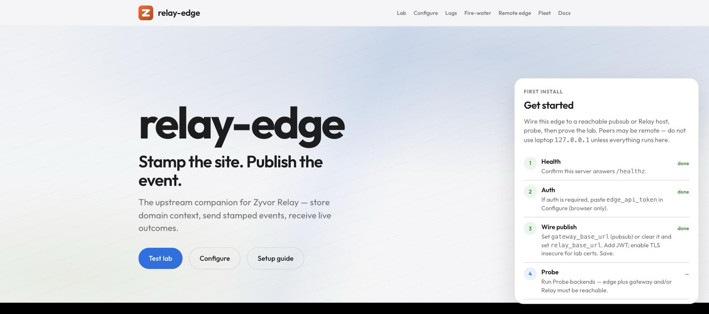

---
hero:
  eyebrow: "RELAY-EDGE"
  title: "The upstream brain for Zyvor Relay."
  lead: "Site topology, three companion simulators, and stamped events — publishing into Relay's Accept → Notify → Ack → Act → Verify loop, without real IoT hardware."
  swatches:
    - {label: "Apache-2.0"}
    - {label: "Go 1.27+"}
  highlights:
    - {value: "47", label: "Firewater sensor points", footnote: "1"}
    - {value: "77", label: "Fleet devices, 18 classes", footnote: "2"}
    - {value: "24", label: "Remote-edge assets", footnote: "3"}
    - {value: "2", label: "Publish paths: direct or via relay-pubsub", footnote: "4"}
  hub_bands:
    - {icon: "❓", title: "FAQ", description: "Licensing, support, scope, and production-readiness questions.", href: "FAQ.md"}
    - {icon: "🏭", title: "Simulators", description: "Farm, firewater, remote-edge, and fleet, each with a web UI and REST API.", href: "SIMULATORS.md"}
    - {icon: "🤝", title: "Integration guide", description: "How relay-edge, Relay, and Zynera fit together, plus the one-command stack scripts.", href: "INTEGRATION.md"}
    - {icon: "🚀", title: "Getting started", description: "Run relay-edge locally in a couple of minutes.", href: "GETTING_STARTED.md"}
    - {icon: "✅", title: "Test results", description: "Lab verification — what we tested, how, and the outcomes.", href: "TEST_RESULTS.md"}
footnotes:
  - {marker: "1", text: "Firewater models a full NFPA-style plant across 47 sensor points.", href: "SIMULATORS.md#overview", href_label: "See Simulators overview."}
  - {marker: "2", text: "Fleet is the master edge catalog: 77 devices across 18 edge classes.", href: "SIMULATORS.md#overview", href_label: "See Simulators overview."}
  - {marker: "3", text: "Remote edge tracks 24 assets across a distributed site NOC.", href: "SIMULATORS.md#overview", href_label: "See Simulators overview."}
  - {marker: "4", text: "Publish via relay-pubsub (production) or directly to Relay.", href: "RELAY.md", href_label: "See Working with Relay."}
---

**relay-edge** is a synthetic IoT/farm site and event simulator for
[Zyvor Relay](https://github.com/zyvorai/relay). It stamps realistic site
topology — seasons, sites, zones, devices, and contacts — onto four
built-in simulators (farm, firewater, remote-edge, fleet) and publishes
stamped events into Relay, either directly or via
[relay-pubsub](https://github.com/zyvorai/relay-pubsub), giving Relay's
Accept → Notify → Ack → Act → Verify loop realistic traffic to develop and
demo against, without real IoT hardware.

For the full project overview, architecture diagram, and quickstart, see
the **[README on GitHub](https://github.com/zyvorai/relay-edge/blob/main/README.md)**.



## Start here

- **[FAQ](FAQ.md)** — licensing, support, scope, and production-readiness questions
- **[Simulators](SIMULATORS.md)** — farm, firewater, remote-edge, and fleet, each with a web UI and REST API
- **[Integration guide](INTEGRATION.md)** — how relay-edge, Relay, and Zynera fit together, plus the one-command stack scripts
- **[Zynera](ZYNERA.md)** — how the optional sibling Zynera control plane relates to relay-edge
- **[Getting started](GETTING_STARTED.md)** — run relay-edge locally in a couple of minutes

## Documentation map

| I want to… | Go to |
|------------|-------|
| Run locally in 2 minutes | [Getting started](GETTING_STARTED.md) |
| Understand the architecture | [Concepts](CONCEPTS.md) |
| **relay-edge + Zynera + Relay together** | **[Integration guide](INTEGRATION.md)** · **[Stack without Zynera (diagrams)](INTEGRATION.md#stack-without-zynera-default)** |
| Simulate full stack (Zynera optional) | `./scripts/e2e-stack.sh` / `./scripts/e2e-direct-stack.sh` — see [Integration](INTEGRATION.md#simulate-all-one-command) |
| **Lab test results (what we ran)** | **[Test results](TEST_RESULTS.md)** |
| Publish into Relay (direct or via pubsub) | [Working with Relay](RELAY.md) |
| Deploy to a host or Kubernetes | [Deployment](DEPLOYMENT.md) |
| **Production / user site** | **[Production runbook](PRODUCTION.md)** |
| **Lab hosts (any may be remote)** | [Deployment § Lab reference](DEPLOYMENT.md#lab-reference) · [Test results](TEST_RESULTS.md) |
| Cut a release / pull GHCR image | [Deployment § CI and releases](DEPLOYMENT.md#ci-and-releases) · [Releases](https://github.com/zyvorai/relay-edge/releases) |
| Drive events through relay-pubsub → Relay | [Event matrix](EVENT_MATRIX.md) |
| Explore firewater / remote-edge / fleet simulators | [Simulators](SIMULATORS.md) |
| Look up HTTP routes | [API reference](API.md) |
| Environment variables | [Configuration](CONFIGURATION.md) |
| Lab Act wiring (TLS / targets) | [`lab-wire-relay-act.sh`](https://github.com/zyvorai/relay-edge/blob/main/scripts/lab-wire-relay-act.sh) · [Test results](TEST_RESULTS.md) |
| Contribute / report security | [Contributing](https://github.com/zyvorai/relay-edge/blob/main/CONTRIBUTING.md) · [Security](https://github.com/zyvorai/relay-edge/blob/main/SECURITY.md) |
| SPDX headers on source | [License headers](LICENSE_HEADERS.md) |
| Use as a customer / operator | [User guide](user/README.md) |

## The stack

```text
  relay-edge          relay-pubsub           Zyvor Relay              Zynera (optional)
  ───────────         ──────────────         ───────────              ─────────────────
  domain + sims  →    Pub/Sub REST     →     Accept                   Decision Records
  simulators          topic = type           Notify → Ack → Act        (human gate)
  /ui control rooms   self-signed TLS        Verify
```

relay-edge never replaces Relay — it **feeds** Relay with stamped, policy-ready events. When Zynera is co-located, Relay may require Zynera freeze/attest before Act — relay-edge does not call Zynera; see [Zynera](ZYNERA.md).

## What's inside this repo

| Piece | Description |
|-------|-------------|
| **Farm domain** | Sites, zones, devices, contacts, seasons — JSON on disk |
| **Stamping** | Every publish enriched with season/site/zone/recipients/probe |
| **Firewater** | 47-point industrial fire-water plant + edge AI/comms |
| **Remote edge** | 24 assets: Starlink, Galleon, UAV, vision, yard IoT |
| **Fleet** | 77 devices across **18** edge classes in one catalog |
| **Web UIs** | `/ui` home + self-test lab · `/ui/firewater.html` · remote-edge · fleet · docs |
| **CI / release** | GitHub Actions: vet + unit + 4 smokes; tag-gated binaries + `ghcr.io/zyvorai/relay-edge` |

## Scripts cheat sheet

```bash
./scripts/smoke.sh                 # farm lifecycle
./scripts/smoke-firewater.sh       # industrial plant
./scripts/smoke-remote-edge.sh     # remote-edge scenarios
./scripts/smoke-fleet.sh           # fleet catalog + scenarios
make smoke-all                     # all four smokes (EDGE=…)
./scripts/e2e-events-matrix.sh     # all 4 families → Relay
./scripts/e2e-direct-relay.sh      # direct Relay (no pubsub, expanded scenarios)
./scripts/e2e-direct-stack.sh      # direct: probe + scenario matrix
./scripts/stack-probe.sh           # health: edge + pubsub + Relay (+ Zynera)
./scripts/stack-probe.sh --direct  # health: edge + Relay only
./scripts/e2e-stack.sh             # no Zynera: probe + event matrix
./scripts/e2e-zynera-stack.sh      # matrix + Zynera path when ZYNERA_* set
./scripts/lab-wire-relay-act.sh HOST  # wire Relay Act → pubsub (TLS insecure)
./scripts/deploy-remote.sh HOST    # systemd (or nohup fallback)
./deploy/scripts/deploy-k8s-remote.sh HOST   # k8s stack (+ sibling relay-pubsub)
```

**CI:** PR/push → vet, `go test`, local smokes (incl. fleet). **Release:** push `v*` or Actions → Release (binaries + GHCR).

**Latest lab verification:** [Test results](TEST_RESULTS.md) (2026-08-29 — **212** + **175** PASS).

## Related projects

- [relay-pubsub](https://github.com/zyvorai/relay-pubsub) — Google Pub/Sub gateway → Relay
- [relay](https://github.com/zyvorai/relay) — control plane
- [Zynera](https://github.com/zyvorai/forge) — AI/K8s at edge sites; Decision Records with Relay
- [Contributing](https://github.com/zyvorai/relay-edge/blob/main/CONTRIBUTING.md) · [Security](https://github.com/zyvorai/relay-edge/blob/main/SECURITY.md) · [Releases](https://github.com/zyvorai/relay-edge/releases)
